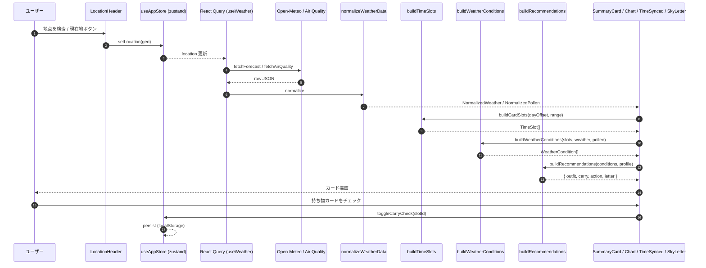
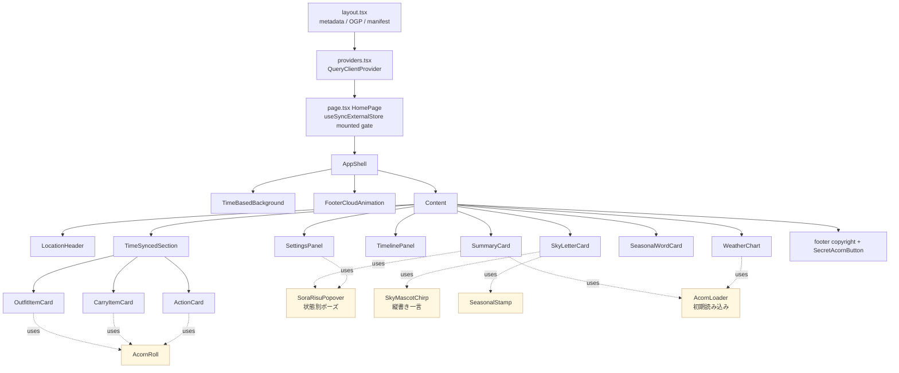

# そらリス アーキテクチャ

最終確認: 2026-05-06

クライアント単独の Next.js (App Router) PWA。サーバ側にはユーザーデータを持たず、外部 API から取得した気象データをブラウザ内で正規化して UI に流す構造。

仕様の本体は [`docs/spec.md`](spec.md)。本ドキュメントは「データの流れ」と「コンポーネントの並び方」を 2 枚の図で素早く把握するための補助資料。

## 1. データフロー

ユーザーが地点を選んでから、画面に服装 / 持ち物 / 行動 / 空だよりが届くまでのシーケンス。

ポイント

- `useWeather` は React Query の `useQuery` を 2 本（forecast と air quality）走らせる。lat/lon が変わるとキー変更で自動再取得
- `weather` は `NormalizedWeather` に整形してから UI に渡す。生 JSON は UI へ届かない
- TimeSlot → WeatherCondition → Recommendations の 3 段で「時間軸 × 対象軸」を直交させ、UI は最終形だけ描画する責務に絞る
- 起動時、`onRehydrateStorage` で過去日付の checks を破棄してからストアが利用可能になる

## 2. コンポーネント階層

`AppShell` をラッパーに、`HomePage` 配下のセクションが縦に並ぶ。マスコット系・どんぐり系の小部品は横断的に再利用される。

ポイント

- `HomePage` は `useSyncExternalStore` を使った mounted ゲートで、SSR 時はスケルトン、ハイドレーション後にダッシュボードへ切替（ローカル日時依存の処理を SSR から外す）
- `WeatherChart` は `next/dynamic({ ssr: false })` で完全にクライアント描画。Recharts の SVG が SSR 不要なため、初期 HTML を軽くする目的
- 黄色背景の部品（`SoraRisuPopover` / `SkyMascotChirp` / `SeasonalStamp` / `AcornRoll` / `AcornLoader`）はカードを跨いで使われる「マスコット・遊び心系」。トーンや動きの基準は [`spec.md` 14 章](spec.md#14-マスコット--遊び心-ui) に集約

## 3. 外部依存

| 種別 | 採用 | 用途 |
| --- | --- | --- |
| 気象 forecast | Open-Meteo Forecast API | 気温 / 気圧 / 降水 / 風 / 湿度 / 天気コード |
| 大気質 | Open-Meteo Air Quality API | 花粉指標 |
| 地点検索 (forward) | Open-Meteo Geocoding API + ローカル辞書 | 名称検索、市町村サフィックス展開 |
| 逆ジオコーディング | BigDataCloud reverse-geocode-client | 「現在地」ボタンで取得した緯度経度の表示名 |
| データ取得層 | TanStack React Query | フェッチ / キャッシュ / 再取得 |
| 永続化 | zustand `persist` + localStorage | 設定 / 地点 / 表示状態 / カード checks |
| Service Worker | Serwist | PWA キャッシュ / オフライン画面 |

商用化フェーズで差し替え検討する候補は [`docs/api-selection.md`](api-selection.md) 参照。
